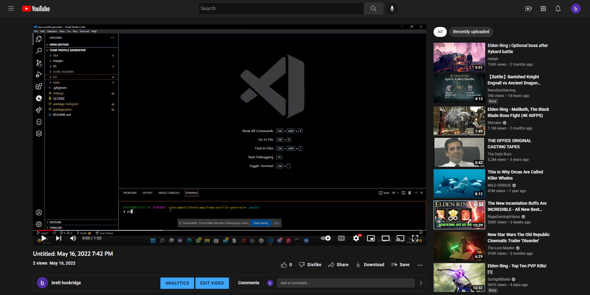
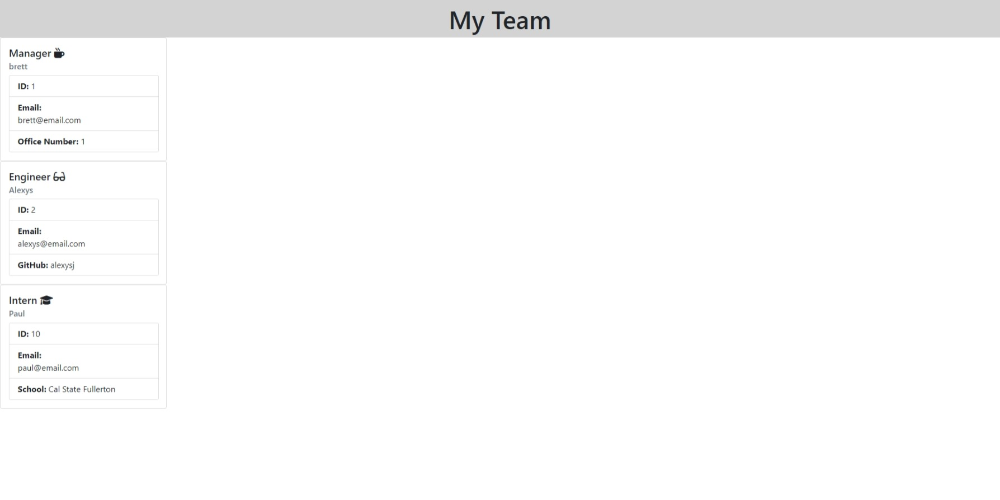

# team-profile-generator

## (Homework 10: Team Profile Generator)

 

## Description: 
---
Node.js application that takes in information about employees on a software engineering team.

 
 

## Table of Contents:
---
* [License](#license)
* [Video](#Video)
* [Screenshot](#Screenshot)
* [Contributions](#contributions)
* [Author](#author)
* [GithubURL](#githuburl)
* [Contact](#contact)

 
 

## License:
---
- MIT License - Copyright (c) 2022 Brett Hockridge

 
 

## Video:
---

## Screenshot:
---
[Screenshot](images/team-screenshot.jpeg) "Screenshot of Web Application"

 
 

## Contributions:
---
You can email me at provided link below to help contribute

 
 

## Author:
---
Brett Hockridge

 
 

## Github URL:
---
Click <a href="https://github.com/BroBrett">here</a> to view my Github.

 
 

## Contact:
---
If you wish to get into contact with me, you can email me at <a href="mailto:brettstephenhockridge@yahoo.com">brettstephenhockridge@yahoo.com.</a>